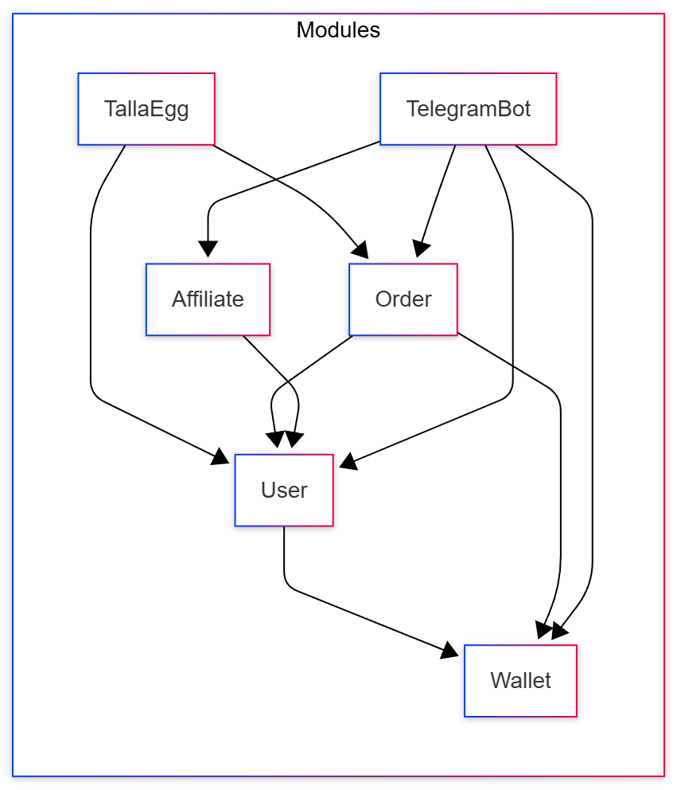

## Component Diagram

This diagram provides a high-level overview of the TallaEgg system's architecture, showcasing the primary modules and their interdependencies. The system is designed with a modular approach, where each component encapsulates a specific set of functionalities.

- **TallaEgg**: The core module that likely serves as the main entry point or orchestrator, integrating the `User` and `Order` modules to deliver the platform's primary services.
- **User**: A central module responsible for managing user-related data, authentication, and profiles. It is a foundational component depended upon by the `Order`, `Wallet`, `Affiliate`, and `TelegramBot` modules.
- **Wallet**: This module manages user balances, asset storage, and transactions (deposits, withdrawals). It is utilized by the `Order` module to check and lock funds and by the `TelegramBot` for balance inquiries.
- **Order**: Handles the creation, management, and matching of trade orders. It interacts with the `User` module to associate orders with users and with the `Wallet` module for financial operations.
- **Affiliate**: Manages the referral and affiliate program, including invitation codes and usage tracking. It is dependent on the `User` module.
- **TelegramBot**: Acts as the primary user interface, allowing users to interact with the system via Telegram. It communicates with all other modules to facilitate user registration, order placement, wallet management, and affiliate interactions.

