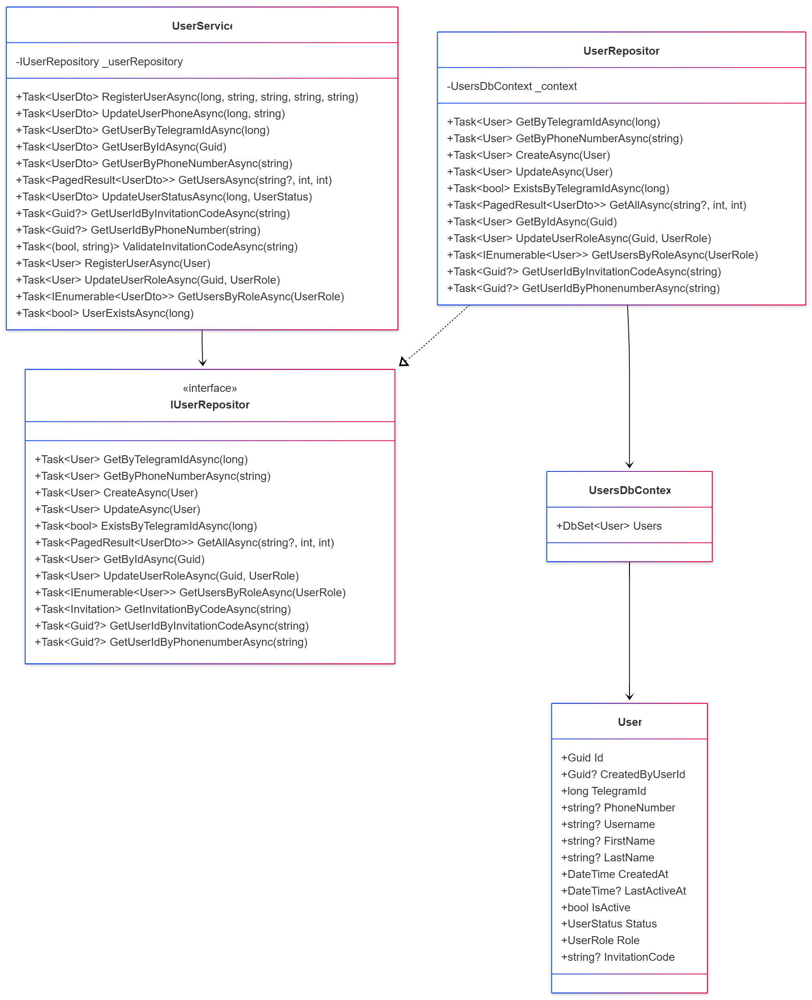
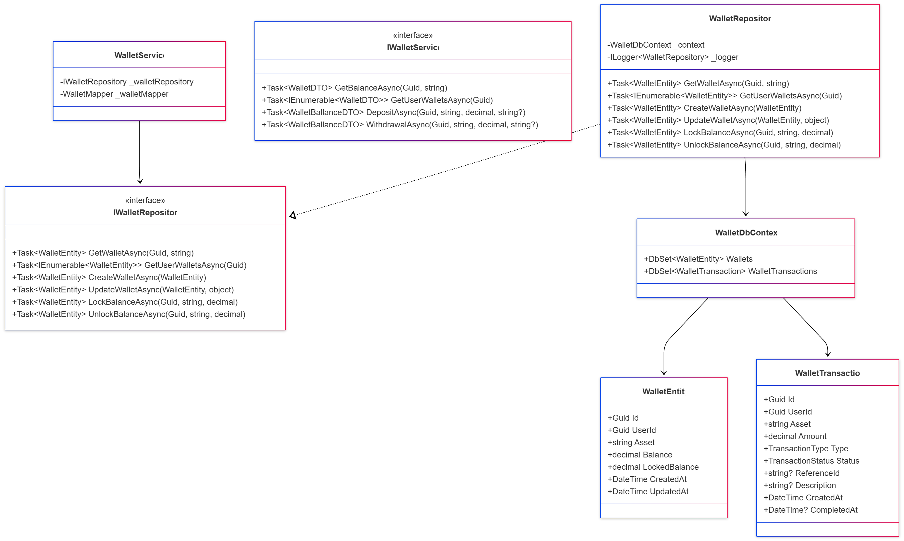
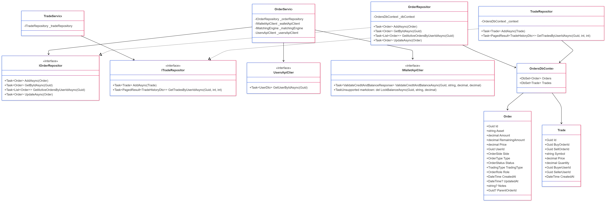
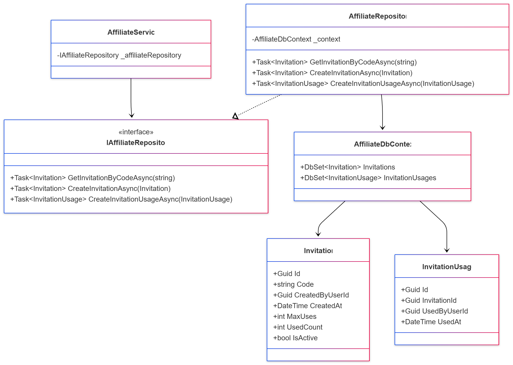
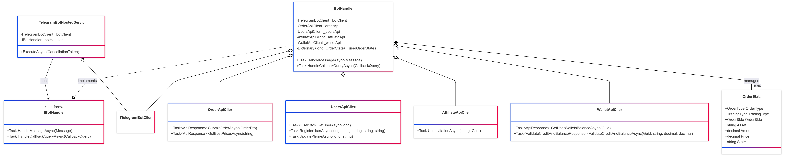

# Class Diagrams

Class diagrams provide a detailed, static view of the system's structure by showing classes, their attributes, methods, and the relationships among them. The following diagrams illustrate the key classes and their interactions within each module, adhering to Clean Architecture and Domain-Driven Design principles.

## User Module

This diagram details the core components of the User module, which is responsible for user management.

- **User**: The main entity representing a system user, with properties like `TelegramId`, `PhoneNumber`, and `Role`.
- **IUserRepository**: An interface defining the contract for data access operations related to users, such as `GetByTelegramIdAsync` and `CreateAsync`. This follows the Dependency Inversion Principle.
- **UserRepository**: The concrete implementation of `IUserRepository`, interacting with the `UsersDbContext` to perform database operations.
- **UserService**: The application service that orchestrates user-related business logic, such as registration and profile updates. It depends on the `IUserRepository` interface, decoupling it from the data access implementation.
- **UsersDbContext**: The Entity Framework database context that manages the connection to the database and the `User` entity.

## Wallet Module

This diagram illustrates the structure of the Wallet module, which handles all aspects of user funds, including balances and transactions.

- **WalletEntity**: Represents a user's wallet for a specific asset, tracking the `Balance` and `LockedBalance`.
- **WalletTransaction**: Records all movements of funds, such as deposits and withdrawals, including their status and type.
- **IWalletRepository**: The interface for the wallet data access layer, defining methods for creating, retrieving, and updating wallets and their balances.
- **WalletRepository**: The implementation of the repository, responsible for the actual database interactions via the `WalletDbContext`.
- **IWalletService**: The application service interface that defines the business operations for the wallet, like `DepositAsync` and `WithdrawalAsync`.
- **WalletService**: The service implementation that orchestrates wallet-related logic, using the `IWalletRepository` to persist changes.
- **WalletDbContext**: The database context for the Wallet module, managing the `WalletEntity` and `WalletTransaction` entities.

## Order Module

This diagram outlines the classes within the Order module, responsible for handling trading activities.

- **Order**: The core entity representing a buy or sell order placed by a user. It contains details like `Asset`, `Amount`, `Price`, `Side`, and `Status`.
- **Trade**: Represents a completed trade that occurs when a buy order and a sell order are matched. It links the two orders and records the execution details.
- **IOrderRepository** & **ITradeRepository**: Interfaces defining the contracts for data access operations for orders and trades, respectively.
- **OrderRepository** & **TradeRepository**: Concrete repository implementations that interact with the `OrdersDbContext`.
- **OrderService**: The primary application service for the module. It orchestrates the entire order lifecycle, from creation to matching, by coordinating with repositories and other modules' API clients.
- **UsersApiClient** & **IWalletApiClient**: API clients used by the `OrderService` to communicate with the User and Wallet modules, for example, to fetch user data or lock funds. This demonstrates cross-module communication.
- **OrdersDbContext**: The database context for storing `Order` and `Trade` entities.

## Affiliate Module

This diagram shows the structure of the Affiliate module, which manages the user invitation and referral system.

- **Invitation**: An entity representing an invitation code created by a user. It includes properties like the `Code`, `MaxUses`, and `UsedCount`.
- **InvitationUsage**: A record of when an invitation code is used by a new user, linking the invitation to the user who used it.
- **IAffiliateRepository**: The interface for the affiliate data access layer, defining methods for creating and retrieving invitations and their usage.
- **AffiliateRepository**: The repository implementation that communicates with the `AffiliateDbContext` to manage persistence.
- **AffiliateService**: The application service that contains the business logic for the affiliate system, such as creating an invitation.
- **AffiliateDbContext**: The database context responsible for the `Invitation` and `InvitationUsage` entities.

## TelegramBot Module

This diagram illustrates the key components of the TelegramBot module, which serves as the user-facing interface for the entire system.

- **TelegramBotHostedService**: A background service (`IHostedService`) that connects to the Telegram API and listens for incoming updates (messages, callbacks). It delegates the handling of these updates to the `IBotHandler`.
- **IBotHandler**: An interface defining the contract for handling different types of Telegram updates.
- **BotHandler**: The core logic unit of the bot. It implements `IBotHandler` and processes incoming messages and callback queries. It maintains user state (e.g., `_userOrderStates` for multi-step operations like creating an order) and interacts with other modules via their respective API clients.
- **OrderState**: A class used to manage the state of a user's interaction, particularly for complex, multi-step processes like creating an order.
- **API Clients (UsersApiClient, OrderApiClient, etc.)**: These clients are responsible for making HTTP requests to the other modules' APIs, effectively integrating the Telegram bot with the backend services.

