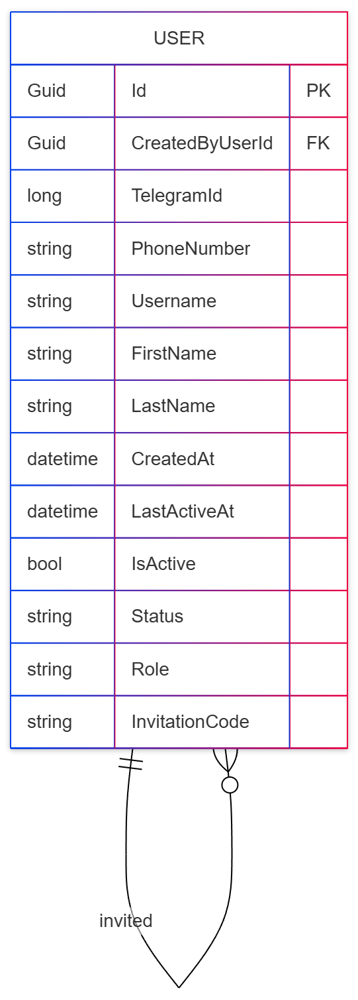
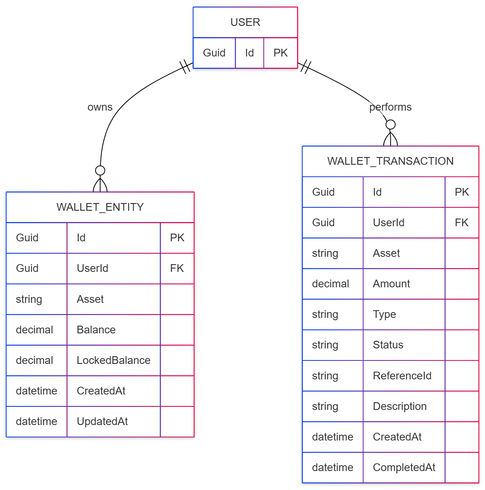
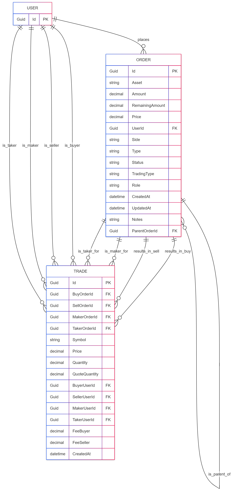
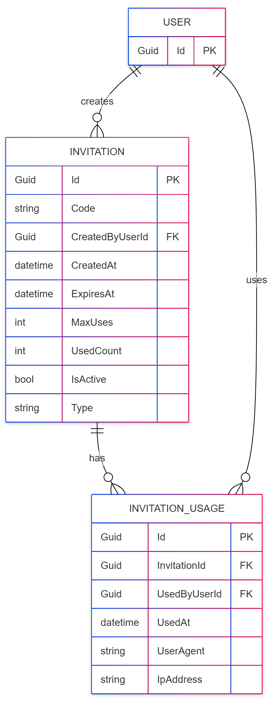

# Entity-Relationship Diagrams
Entity-Relationship Diagrams (ERDs) visualize the database schema by showing the entities (tables), their attributes (columns), and the relationships between them. These diagrams help in understanding the data model and how different pieces of information are connected.

## User Module
This ERD illustrates the data model for the User module.

- **USER**: The central table storing all user information.
- The diagram shows a self-referencing relationship (`invited`), where a user can be invited by another user (`CreatedByUserId`), forming a simple referral tracking system within the user table itself.

## Wallet Module
This ERD shows the data structure for the Wallet module.

- **USER**: The user entity, acting as the owner of wallets and transactions.
- **WALLET_ENTITY**: Represents a user's wallet for a specific currency or asset. A user can have multiple wallets (one for each asset), hence the one-to-many relationship.
- **WALLET_TRANSACTION**: A log of all financial transactions (deposits, withdrawals) performed by a user. Each transaction is linked to a specific user.

## Order Module
This ERD details the data model for the Order module, which is central to the trading platform.

- **USER**: The user who places orders and participates in trades.
- **ORDER**: The table storing all buy and sell orders. It has a self-referencing relationship (`is_parent_of`) to support complex order types (e.g., one-cancels-the-other). It is linked to the `USER` table.
- **TRADE**: The table that records every executed trade. A trade is the result of matching a buy order and a sell order. It has multiple foreign keys linking to the `ORDER` table (for buy/sell and maker/taker orders) and the `USER` table (for buyer/seller and maker/taker users) to provide a comprehensive view of the transaction.

## Affiliate Module
This ERD illustrates the data model for the Affiliate module.

- **USER**: The user who creates an invitation or uses one.
- **INVITATION**: The table storing invitation codes. Each invitation is created by a `USER`.
- **INVITATION_USAGE**: A join table that records which `USER` has used which `INVITATION`, effectively tracking the entire referral lifecycle.

