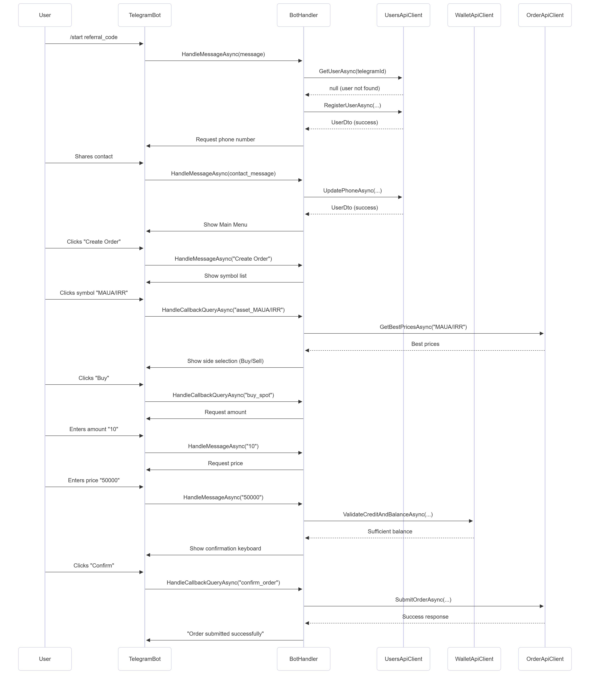

# Sequence Diagrams

Sequence diagrams are used to model the interactions between objects in a system over time. They show the messages exchanged between objects and the order in which they occur.

## User Registration & Order Placement (TelegramBot)

This diagram illustrates a common user workflow from the perspective of the Telegram bot, detailing the sequence of events from initial user interaction to successful order placement.

1.  **User Registration**:
    *   A new user starts the bot, optionally with a referral code.
    *   The `BotHandler` checks if the user exists via the `UsersApiClient`.
    *   Since the user is new, it proceeds with registration and requests the user's phone number for verification.
    *   Upon receiving the contact information, the user's profile is updated.

2.  **Order Placement**:
    *   The user initiates the order creation process from the main menu.
    *   The bot guides the user through a series of steps: selecting the asset, order side (buy/sell), amount, and price.
    *   Each step involves a message from the user, which is handled by the `BotHandler`.
    *   Before confirming, the `BotHandler` calls the `WalletApiClient` to ensure the user has sufficient funds.
    *   Once validated, the user confirms the order.
    *   The `BotHandler` then sends the request to the `OrderApiClient` to submit the order to the matching engine.
    *   Finally, the bot sends a confirmation message to the user.

