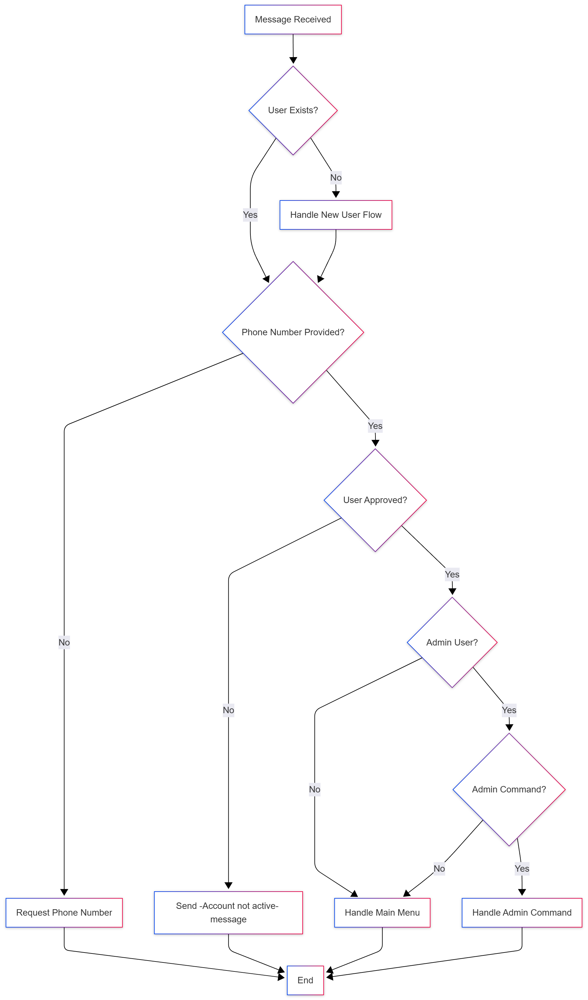

# Activity Diagrams

Activity diagrams describe the flow of control in a system. They are useful for modeling business processes and workflows.

## Order Matching

This diagram illustrates the workflow of the matching engine when a new order is received.

1.  The process starts when an order is received.
2.  The engine searches the order book for a matching order (e.g., a buy order for an incoming sell order at a compatible price).
3.  If a match is found, a `Trade` is created, and the statuses of the involved orders are updated (e.g., to `Completed` or `PartiallyFilled`). The relevant users are then notified.
4.  If no match is found, the new order is placed in the order book to await a future match.

## Message Handling (TelegramBot)

This diagram shows the logic flow within the `BotHandler` when a new message is received from a user.

1.  The bot first checks if the user is already registered in the system. If not, it initiates the new user registration flow.
2.  It then verifies if the user has provided a phone number and if their account is active and approved.
3.  For approved users, the bot checks if they have administrative privileges.
4.  If the user is an admin, it checks for specific admin commands. Otherwise, it proceeds to the standard user main menu.
5.  This structured flow ensures that users are properly authenticated and authorized before they can access different levels of functionality.

