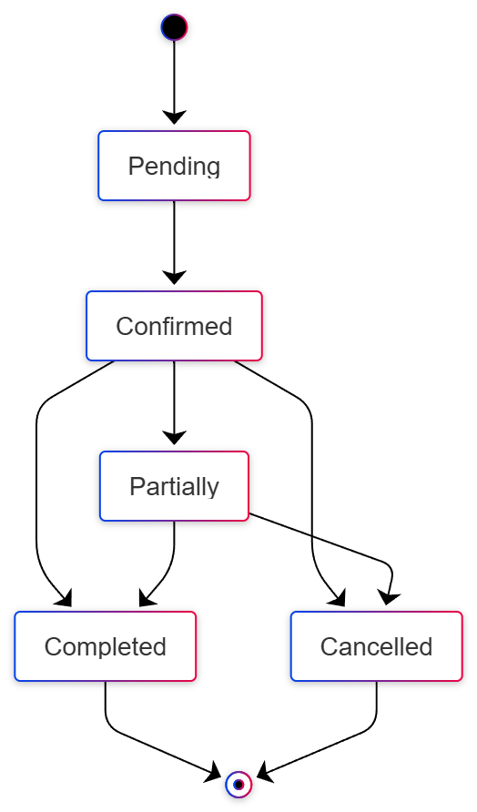

# State Diagrams

State diagrams are used to describe the behavior of a single object, showing the different states it can be in and the transitions between those states.

## Order Status

This diagram models the lifecycle of an `Order` entity from its creation to its completion.

- **Pending**: The initial state of an order after it has been submitted but not yet confirmed or processed by the matching engine.
- **Confirmed**: The state after the order is validated and accepted into the order book.
- **Partially**: This state is reached if the order is partially filled through a trade but some of the original amount remains.
- **Completed**: The final state for an order that has been fully filled.
- **Cancelled**: An order can be cancelled by the user if it has not been fully filled.

The transitions show the valid paths an order can take, for example, an order can be cancelled from a `Confirmed` or `Partially` filled state, but not after it is `Completed`.

