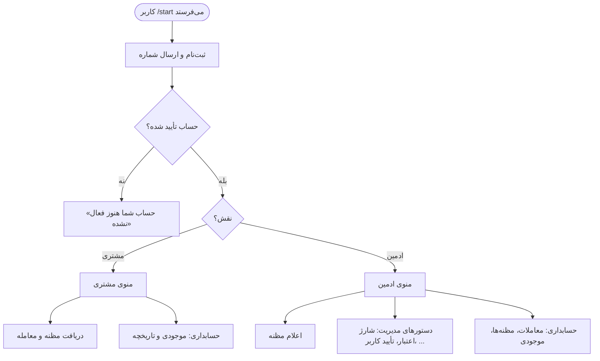
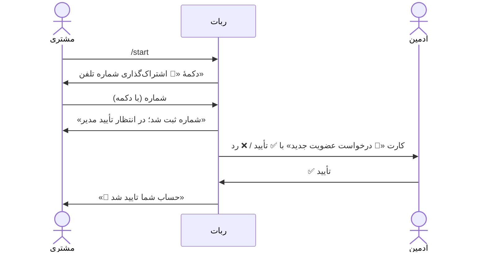
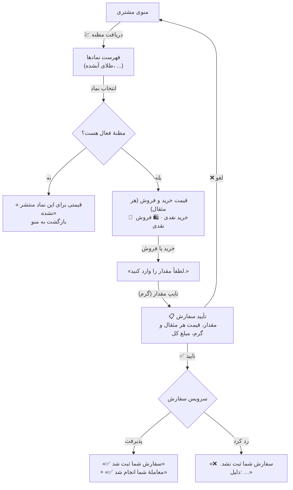
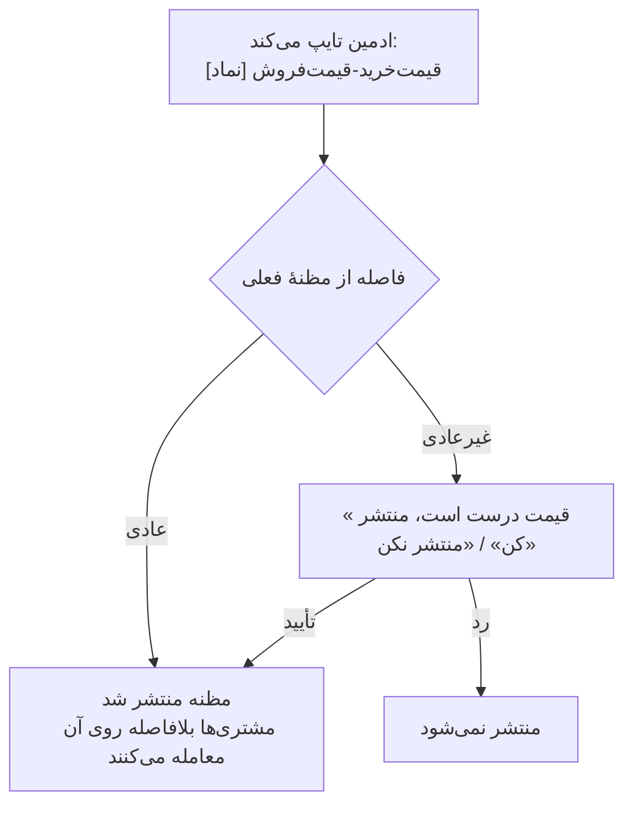

# نقشهٔ جریان کاربر ربات تلگرام

> این سند به فارسی است چون مخاطبش کل تیم است، از جمله اعضای غیرفنی، و در دمو و مصاحبه با
> مشتری استفاده می‌شود. طبق استثنای بند ۱ در [`../process/STANDARDS.md`](../process/STANDARDS.md).

**وضعیت:** از روی کد نسخهٔ ۱.۵.۰ خوانده شده (`TelegramBot/TallaEgg.TelegramBot.Infrastructure`) ·
**مرجع:** بند «مستندسازی خط مبنای ربات» در [`../OKR.md`](../OKR.md)

این سند می‌گوید ربات **امروز** چه می‌کند، نه آنچه باید بکند. هر جا رفتار فعلی عجیب یا ناهماهنگ
است، در بخش ۸ فهرست شده و در این سند اصلاح نشده است.

---

## ۱. دو نقش، دو ربات

ربات برای هر کس بر اساس نقشش منوی متفاوتی نشان می‌دهد:

| نقش | چه کسی | منوی اصلی |
|---|---|---|
| **مشتری** | هر کاربر تأییدشده با نقش «کاربر عادی» یا «حسابدار» | `💹 دریافت مظنه` · `❓ راهنما` · `📊 حسابداری` |
| **ادمین** | نقش «مدیر» یا «مدیر ارشد»، یا شناسهٔ تلگرامی که در `OwnerTelegramIds` تنظیم شده | `💹 اعلام مظنه` · `📊 حسابداری` · `❓ راهنما` + دستورهای متنی |

ادمین طرف مقابل همهٔ معامله‌هاست: مشتری با قیمتی که ادمین اعلام کرده می‌خرد یا می‌فروشد
(جزئیات در [`DEALER_QUOTE_MODEL.md`](DEALER_QUOTE_MODEL.md)).

---

## ۲. ثبت‌نام و تأیید حساب

1. **شروع.** کاربر `/start` می‌فرستد و بی‌درنگ ثبت‌نام می‌شود. کد معرف لازم نیست مگر
   `RequireReferralCode` روشن باشد (در پیکربندی نمونه خاموش است)؛ در آن حالت ربات کد معرف
   می‌خواهد.

   > 📷 **تصویر ۰۱** — درخواست شماره بعد از `/start`

2. **ارسال شماره.** فقط با دکمهٔ «📱 اشتراک‌گذاری شماره تلفن» پذیرفته می‌شود؛ تایپ شماره کار
   نمی‌کند و ربات دوباره دکمه را نشان می‌دهد.

   > 📷 **تصویر ۰۲** — «✅ شماره تلفن شما ثبت شد… در انتظار تایید مدیر»

3. **انتظار.** تا تأیید، هر پیامی پاسخ «حساب کاربری شما هنوز فعال نشده است» می‌گیرد.

   > 📷 **تصویر ۰۳** — پاسخ ربات به کاربر تأییدنشده

4. **تأیید ادمین.** همهٔ ادمین‌ها کارت درخواست عضویت را با نام، شماره، نام کاربری و شناسهٔ
   تلگرام می‌گیرند. راه دوم تأیید، دستور متنی `ت [شماره]` (و رد: `ر [شماره]`) است.

   > 📷 **تصویر ۰۴** — کارت درخواست عضویت در چت ادمین

5. **فعال شدن.** مشتری پیام تأیید را می‌گیرد و از پیام بعدی منوی مشتری را می‌بیند.

   > 📷 **تصویر ۰۵** — «🎉 حساب شما تایید شد»

**مالک استقرار** (شناسه‌ای که در `OwnerTelegramIds` است) از این مرحله معاف است: با ارسال شماره
خودبه‌خود تأیید و «مدیر» می‌شود، چون روی دیتابیس خالی کس دیگری نیست که تأییدش کند.

---

## ۳. معامله: دریافت مظنه، خرید و فروش

این مسیر اصلی محصول و مسیر دموست.

1. **منوی مشتری.**

   > 📷 **تصویر ۰۶** — منوی اصلی مشتری

2. **انتخاب نماد.** فقط نمادهای فعال نشان داده می‌شوند (ادمین با `نماد فعال|غیرفعال` کنترلشان
   می‌کند).

   > 📷 **تصویر ۰۷** — فهرست نمادها

3. **دیدن قیمت.** ربات قیمت خرید و فروش را **هر مثقال** نشان می‌دهد و نوع معامله را می‌پرسد.
   اگر مظنه‌ای منتشر نشده باشد، همین‌جا به منو برمی‌گردد.

   > 📷 **تصویر ۰۸** — «📊 بهترین قیمت‌های بازار» با دکمه‌های خرید و فروش

4. **وارد کردن مقدار.** مقدار طلا **به گرم** است و با ارقام فارسی یا انگلیسی پذیرفته می‌شود.
   مشتری قیمت وارد نمی‌کند؛ قیمت همان مظنهٔ ادمین است. دکمهٔ «🔙 بازگشت» در همهٔ این مراحل
   مشتری را به منو برمی‌گرداند.

   > 📷 **تصویر ۰۹** — درخواست مقدار

5. **تأیید سفارش.** برای طلا هر دو قیمت (هر مثقال و هر گرم) و مبلغ کل نشان داده می‌شود.

   > 📷 **تصویر ۱۰** — «📋 تأیید سفارش»

6. **نتیجه.** معامله در همان لحظه با ادمین انجام و تسویه می‌شود و دو پیام می‌آید.

   > 📷 **تصویر ۱۱** — «✅ سفارش شما ثبت شد» و «✅ معاملهٔ شما انجام شد»

   اگر سرویس سفارش نپذیرد — مثلاً موجودی و اعتبار کافی نیست یا از سقف معامله بیشتر است — دلیل را
   می‌گوید.

   > 📷 **تصویر ۱۲** — «❌ سفارش شما ثبت نشد» (مثلاً با موجودی ناکافی)

**افزایش موجودی در ربات ممکن نیست.** درگاه پرداخت وجود ندارد؛ اعتبار را طلافروشی (ادمین) با
دستور `ش` اضافه می‌کند و ربات همین را به مشتری می‌گوید.

---

## ۴. حسابداری مشتری

`📊 حسابداری` دو گزینه دارد:

| دکمه | چه نشان می‌دهد |
|---|---|
| `💵 موجودی` | برای هر دارایی: موجودی، اعتبار، بدهی (اگر روی اعتبار معامله کرده)، و سود و زیان |
| `📊 تاریخچه معاملات` | معامله‌های مشتری، پنج‌تا پنج‌تا با دکمهٔ صفحه‌بندی |

> 📷 **تصویر ۱۳** — منوی حسابداری مشتری
>
> 📷 **تصویر ۱۴** — صفحهٔ موجودی
>
> 📷 **تصویر ۱۵** — تاریخچهٔ معاملات

`❓ راهنما` توضیح کوتاه دکمه‌ها و واحدها (قیمت هر مثقال، مقدار به گرم) را می‌دهد.

> 📷 **تصویر ۱۶** — راهنمای مشتری

---

## ۵. ادمین: اعلام مظنه

- **دستور:** قیمت خرید و فروش هر مثقال با خط تیره، مثلاً `79000000-79500000`. بدون نام نماد،
  طلای آبشده فرض می‌شود.
- **دکمهٔ `💹 اعلام مظنه`** مظنه ثبت نمی‌کند؛ آخرین مظنهٔ منتشرشدهٔ هر نماد را نشان می‌دهد.
- **باند قیمت:** قیمتی که خیلی از مظنهٔ فعلی دور باشد — مثلاً یک صفر اضافه — بدون تأیید دوباره
  منتشر نمی‌شود. همین سؤال برای مظنهٔ خودکار هم به همهٔ ادمین‌ها فرستاده می‌شود.
- **مظنهٔ خودکار:** `اتومات روشن|خاموش` و `اسپرد [درصد]`. به‌طور پیش‌فرض خاموش است.

> 📷 **تصویر ۱۷** — منوی اصلی ادمین
>
> 📷 **تصویر ۱۸** — تایپ مظنه و پیام «منتشر شد»
>
> 📷 **تصویر ۱۹** *(اختیاری)* — سؤال «قیمت درست است، منتشر کن» برای قیمت خارج از باند

---

## ۶. ادمین: دستورهای مدیریت

همه با تایپ یک حرف در چت ربات اجرا می‌شوند. شماره‌ها با ارقام فارسی یا انگلیسی پذیرفته
می‌شوند.

| دستور | کار | چه کسی پیام می‌گیرد |
|---|---|---|
| `ش [شماره] [مقدار] [دارایی]` | افزایش **اعتبار** مشتری (پیش‌فرض: طلای آبشده) | ادمین و مشتری |
| `د [شماره] [مقدار] [دارایی]` | کسر از اعتبار (معکوس `ش`) | ادمین و مشتری |
| `ت [شماره]` / `ر [شماره]` | تأیید / رد حساب | ادمین و مشتری |
| `ک [جستجو]` | فهرست کاربران، صفحه‌بندی‌شده | ادمین |
| `م [شماره]` | موجودی یک مشتری | ادمین |
| `س [شماره]` | معامله‌های یک مشتری | ادمین |
| `ن [شماره] [نقش]` | تغییر نقش (کاربر عادی، حسابدار، مدیر، مدیر ارشد) | ادمین و کاربر |
| `نماد فعال\|غیرفعال [نماد]` | نمایش یا پنهان کردن نماد برای مشتری | ادمین |
| `اتومات روشن\|خاموش [نماد]` · `اسپرد [درصد] [نماد]` | مظنهٔ خودکار | ادمین |

`📊 حسابداری` ادمین علاوه بر موجودی و تاریخچهٔ معاملات، `📋 تاریخچه مظنه‌ها` هم دارد. موجودی ادمین
همان دفتر حساب طلافروشی است و منفی بودنش عادی است.

> 📷 **تصویر ۲۰** — دستور `ش` و پاسخ ربات به ادمین
>
> 📷 **تصویر ۲۱** — پیام «✅ اعتبار حساب شما افزایش یافت» در چت مشتری
>
> 📷 **تصویر ۲۲** — فهرست کاربران با دستور `ک`
>
> 📷 **تصویر ۲۳** — راهنمای ادمین

---

## ۷. پیام‌هایی که ربات بی‌درخواست می‌فرستد

| وقتی | به چه کسی | پیام |
|---|---|---|
| ثبت‌نام کاربر جدید | همهٔ ادمین‌ها | کارت درخواست عضویت |
| تأیید / رد حساب | همان کاربر | تأیید یا رد |
| `ش` / `د` | همان مشتری | افزایش یا کسر اعتبار |
| تغییر نقش | همان کاربر | نقش جدید |
| مظنهٔ خودکار خارج از باند | همهٔ ادمین‌ها | سؤال انتشار (حداکثر یک بار در ۱۵ دقیقه برای هر نماد) |
| راه‌اندازی دوبارهٔ ربات | **همهٔ کاربران** | «ربات به‌روز شد» یا «ربات دوباره در دسترس است» |

---

## ۸. ناهماهنگی‌هایی که هنگام نوشتن این نقشه دیده شد

هیچ‌کدام در این تغییر اصلاح نشده‌اند؛ هر کدام اگر ارزش کار داشته باشد باید issue جدا بگیرد.

1. **کاربر تأییدنشده منوی کامل می‌بیند.** بعد از ارسال شماره، ربات هم «در انتظار تأیید» می‌گوید
   و هم منوی اصلی را نشان می‌دهد؛ هر دکمه‌ای که بزند فقط «حساب شما هنوز فعال نشده» می‌گیرد.
2. **پیام موفقیت سفارش به دکمه‌ای اشاره می‌کند که وجود ندارد.** «سفارش‌های در جریان را از
   «سفارشات فعال» ببینید» — چنین دکمه‌ای در هیچ منویی نیست. همان پیام می‌گوید «به‌محض انجام
   معامله اطلاع می‌دهیم» درحالی‌که در مسیر مظنه، معامله در همان لحظه انجام شده و پیامش بلافاصله
   بعد می‌آید.
3. **راهنمای ادمین با دستورها نمی‌خواند.** `س` را «سفارش‌های فعال کاربر» معرفی می‌کند اما
   معامله‌های مشتری را نشان می‌دهد، و دستور `نماد` در راهنما نیامده است.
4. **نقش «حسابدار» منوی مشتری می‌گیرد.** قابل تعیین است ولی هیچ منو یا دسترسی جداگانه‌ای ندارد.
5. **سفارش نیمه‌کاره با راه‌اندازی دوبارهٔ ربات از دست می‌رود.** وضعیت گفتگو فقط در حافظه است؛
   مشتری‌ای که وسط سفارش باشد «خطا در پردازش سفارش» می‌گیرد و باید از منو دوباره شروع کند.
6. **بیش از ۱۰ نماد نمایش داده نمی‌شود.** نمادهای بعدی بی‌صدا از فهرست حذف می‌شوند؛ امروز با تعداد
   کم نمادها دیده نمی‌شود.

---

## ۹. فهرست تصاویر

تصاویر در پوشهٔ `docs/architecture/bot-user-flow/` قرار می‌گیرند و جای «📷 تصویر» در متن بالا
را می‌گیرند.

**این مخزن عمومی است.** هر تصویر باید از **حساب آزمایشی** گرفته شود: بدون نام، شماره، نام کاربری
یا شناسهٔ تلگرام واقعی، و بدون موجودی حساب‌های واقعی. کارت درخواست عضویت (تصویر ۰۴) و فهرست
کاربران (تصویر ۲۲) این اطلاعات را مستقیم نشان می‌دهند.

| # | نام فایل | صفحه |
|---|---|---|
| ۰۱ | `01-start-phone-request.png` | درخواست شماره بعد از `/start` |
| ۰۲ | `02-phone-registered.png` | شماره ثبت شد، در انتظار تأیید |
| ۰۳ | `03-not-approved.png` | پاسخ به کاربر تأییدنشده |
| ۰۴ | `04-admin-membership-card.png` | کارت درخواست عضویت (ادمین) |
| ۰۵ | `05-account-approved.png` | حساب تأیید شد |
| ۰۶ | `06-customer-main-menu.png` | منوی اصلی مشتری |
| ۰۷ | `07-symbol-picker.png` | فهرست نمادها |
| ۰۸ | `08-prices-and-side.png` | قیمت‌ها و دکمهٔ خرید/فروش |
| ۰۹ | `09-amount-prompt.png` | درخواست مقدار |
| ۱۰ | `10-order-confirmation.png` | تأیید سفارش |
| ۱۱ | `11-trade-executed.png` | سفارش ثبت شد + معامله انجام شد |
| ۱۲ | `12-order-refused.png` | سفارش ثبت نشد |
| ۱۳ | `13-customer-accounting-menu.png` | منوی حسابداری مشتری |
| ۱۴ | `14-wallet-balance.png` | موجودی |
| ۱۵ | `15-trade-history.png` | تاریخچهٔ معاملات |
| ۱۶ | `16-customer-help.png` | راهنمای مشتری |
| ۱۷ | `17-admin-main-menu.png` | منوی اصلی ادمین |
| ۱۸ | `18-admin-publish-quote.png` | اعلام مظنه |
| ۱۹ | `19-admin-quote-out-of-band.png` | *(اختیاری)* قیمت خارج از باند |
| ۲۰ | `20-admin-credit-charge.png` | دستور `ش` (ادمین) |
| ۲۱ | `21-customer-credit-increased.png` | افزایش اعتبار (مشتری) |
| ۲۲ | `22-admin-user-list.png` | فهرست کاربران |
| ۲۳ | `23-admin-help.png` | راهنمای ادمین |
