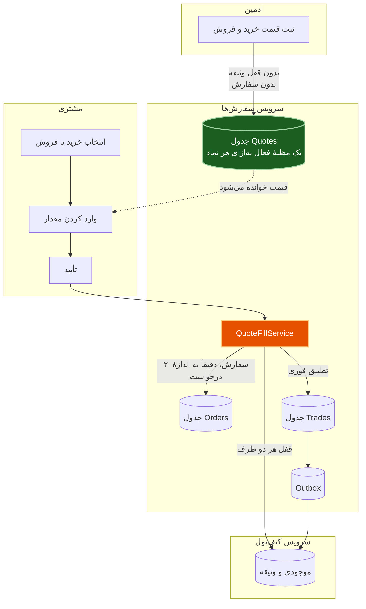
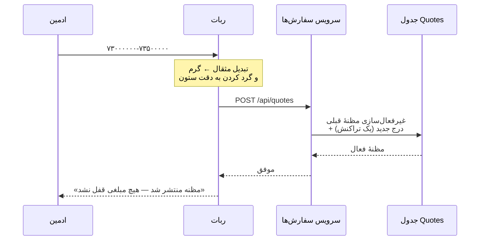
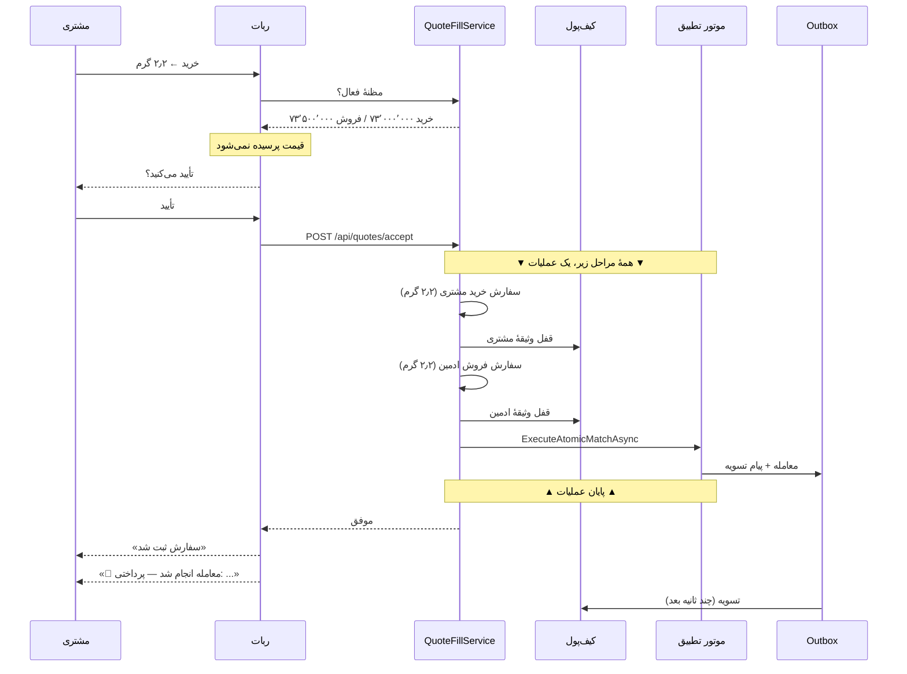
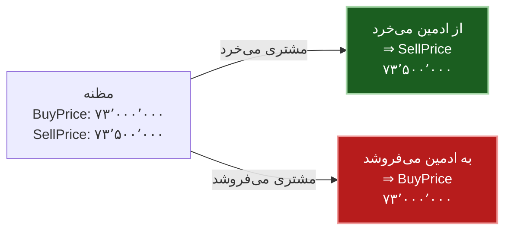
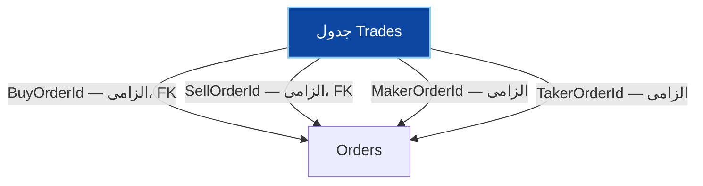
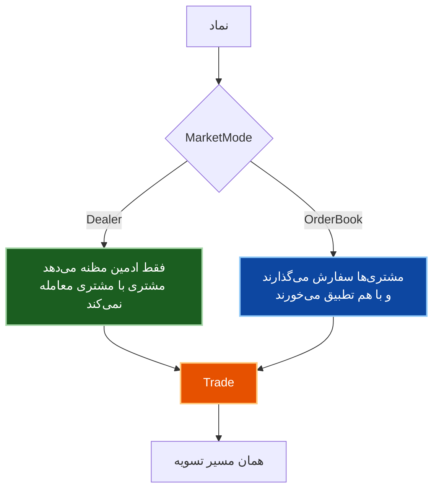

# مدل مظنه‌ای (Dealer) — معماری و سناریوها

> این سند به فارسی است چون مدلی کسب‌وکاری را توضیح می‌دهد که مخاطبش کل تیم است،
> از جمله اعضای غیرفنی. طبق استثنای بند ۱ در [`../process/STANDARDS.md`](../process/STANDARDS.md).

**مرجع:** issue #48 · **وضعیت:** پیاده‌سازی‌شده و تست‌شده روی محیط توسعه

---

## ۱. مسئله‌ای که حل شد

مدل کسب‌وکار این است: **طلافروش قیمت می‌دهد، مشتریانش با او معامله می‌کنند.**
ولی سیستم یک دفتر سفارش نظیربه‌نظیر بود، و «قیمت دادن» با دو سفارش شبیه‌سازی می‌شد:

```csharp
const decimal defaultAmount = 1000m;   // ← عدد دلبخواه
```

پنج پیامد داشت:

| # | مشکل |
|---|---|
| ۱ | مقدار ۱۰۰۰ گرم **دلبخواه** بود — نه ظرفیت واقعی طلافروش بود نه نیاز مشتری |
| ۲ | حدود **۱۹ میلیارد تومان و ۱۰۰۰ گرم** وثیقه فقط برای «اعلام قیمت» قفل می‌شد |
| ۳ | مشتری‌ها می‌توانستند با **یکدیگر** معامله کنند و ادمین را دور بزنند |
| ۴ | با مصرف شدن ۱۰۰۰ گرم، **نقدینگی تمام** می‌شد تا ثبت دستی بعدی |
| ۵ | آنچه ادمین «مظنهٔ امروز» می‌دانست، سیستم «سفارش» ذخیره می‌کرد |

---

## ۲. معماری



**قاعدهٔ اصلی:** انتشار مظنه هیچ چیزی در دفتر نمی‌گذارد و هیچ وثیقه‌ای قفل نمی‌کند.
سفارش‌ها فقط در لحظهٔ معامله زاده می‌شوند و همان لحظه می‌میرند.

---

## ۳. سناریو الف — ادمین مظنه می‌دهد



**نکته:** غیرفعال‌سازی قبلی و درج جدید **اتمی**اند. اگر جدا بودند، لحظه‌ای وجود داشت که
نماد یا دو مظنهٔ فعال داشت (معلوم نیست مشتری روی کدام معامله می‌کند) یا هیچ‌کدام
(معاملهٔ معتبر رد می‌شد).

---

## ۴. سناریو ب — مشتری می‌خرد



**مشتری قیمت وارد نمی‌کند.** این تمام ابهام «مثقال یا گرم؟» را از جریان مشتری حذف
می‌کند — تنها جایی که کاربر می‌توانست عدد را با واحد اشتباه وارد کند.

---

## ۵. جهت قیمت — جایی که اشتباه گران تمام می‌شود



این نگاشت عمداً روی **خود موجودیت `Quote`** است (`PriceFor(side)`) و نه در سرویس.
جابه‌جا کردن این دو، همان **باگ وارونگی خریدار/فروشنده** است با لباس دیگر — و آن باگ
یک بار به تولید رسید. کد کنار داده‌ای نگه داشته می‌شود که توصیفش می‌کند.

**اسپرد منفی رد می‌شود:** اگر `BuyPrice > SellPrice` باشد، مشتری می‌توانست بی‌نهایت بار
بخرد و بفروشد و هر بار سود کند — مستقیماً از جیب طلافروش.

---

## ۶. چرا سفارش می‌سازد و نه مستقیم معامله

سؤال طبیعی: «اگر معامله فوری است، چرا اصلاً سفارش می‌سازیم؟»



`Trade` بدون سفارش وجود ندارد. ساختنش یا **تغییر schema** می‌خواست یا **مسیر دوم ساخت
معامله** — و مسیر دوم دقیقاً همان چیزی است که issue #40 دربارهٔ آن است.

با ساختن سفارش، همان `ExecuteAtomicMatchAsync` که امروز کار می‌کند استفاده می‌شود، پس:

| بخش | وضعیت |
|---|---|
| `Trade` | دست‌نخورده |
| Outbox و تسویه | دست‌نخورده |
| کیف‌پول | دست‌نخورده |
| تاریخچهٔ سفارش و معامله | دست‌نخورده |
| گزارش‌ها | دست‌نخورده |

---

## ۷. همزیستی با دفتر سفارش

`MarketMode` به‌ازای هر نماد تعیین می‌کند کدام مسیر فعال است:



چون هر دو به یک `Trade` می‌رسند، **بدون هیچ ماشین‌آلات اضافه‌ای** کنار هم کار می‌کنند.
`MAUA/IRT` الان `Dealer` است؛ وقتی نقدینگی واقعی به وجود آمد با یک تغییر تنظیمات به
`OrderBook` می‌رود.

### تنظیمات

```json
"Matching": {
  "MarketMakerUserId": "ACE3A6E8-...",
  "MarketModes": { "MAUA/IRT": "Dealer" }
}
```

- تنظیم مخصوص نماد بر تنظیم سراسری اولویت دارد
- تنظیم قدیمی `RequireMarketMakerCounterparty` همچنان معتبر است و یعنی `Dealer`
- بدون هیچ تنظیمی: `OrderBook` (رفتار تاریخی سیستم)
- تغییر تنظیمات **نیاز به ری‌استارت ندارد**
- `Dealer` بدون `MarketMakerUserId` یک **خطای پیکربندی** است: لاگ می‌شود و قاعده
  اعمال نمی‌گردد — بی‌صدا نمی‌ماند

---

## ۸. نتایج اندازه‌گیری‌شده

هفت معاملهٔ واقعی روی محیط توسعه (۷ مرداد ۱۴۰۵):

| معیار | قبل | بعد |
|---|---|---|
| اعلام قیمت | ۲ سفارش ۱۰۰۰ گرمی | یک سطر مظنه |
| وثیقهٔ قفل‌شده برای اعلام قیمت | ~۱۹ میلیارد + ۱۰۰۰ گرم | **صفر** |
| سفارش باز پس از ۷ معامله | انباشته | **صفر** |
| `LockedBalance` پس از ۷ معامله | باقی‌مانده | **صفر در همهٔ کیف‌پول‌ها** |
| نقدینگی | تا مصرف ۱۰۰۰ گرم | نامحدود، هر بار به اندازهٔ نیاز |
| مشتری قیمت وارد می‌کند | بله | **خیر** |

**حفظ پول:** طلا `−۱۱۷٫۲۵ + ۴۸ + ۶۹٫۲۵ = ۰` · تومان `+۲٬۱۶۵٬۳۷۹٬۲۹۱ − ۸۷۶٬۱۰۰٬۰۰۴ − ۱٬۲۸۹٬۲۷۹٬۲۸۷ = ۰`

۴۷ تسویه، هر معامله دقیقاً ۴ سطر، ۰ retry، ۰ خطا، ۰ هشدار.

---

## ۹. آنچه این مدل حل نمی‌کند

| موضوع | جای پیگیری |
|---|---|
| ادمین سقف ندارد و موجودی‌اش منفی می‌رود | #61 — پایش موقعیت مارجین |
| اعتبار مشتری (`CREDIT_`) هرگز مصرف نمی‌شود | #36 — مدل اعتبار |
| کارمزد و حساب کارمزد | #35 |
| معاملات آتی واقعی (سررسید، قیمت مستقل) | خارج از دامنه — ابزار متفاوت، دفتر جدا |

**مارجین یک بازار نیست، یک روش تأمین مالی است.** سفارش اعتباری و نقدی همان گرم را با
همان قیمت معامله می‌کنند و باید در یک دفتر با هم تطبیق بخورند. به همین دلیل `MarketMode`
فقط `Dealer` و `OrderBook` دارد و مقداری برای مارجین ندارد.

---

## ۱۰. نقشهٔ کد

| فایل | نقش |
|---|---|
| `Orders.Core/Quote.cs` | موجودیت مظنه، `PriceFor()`، رد اسپرد منفی |
| `Orders.Infrastructure/QuoteRepository.cs` | انتشار اتمی، خواندن مظنهٔ فعال |
| `Orders.Application/Services/QuoteFillService.cs` | ساخت جفت سفارش، قفل، تطبیق فوری |
| `Orders.Application/Services/MarketModeProvider.cs` | حالت بازار هر نماد |
| `TallaEgg.Core/Enums/Order/MarketMode.cs` | `Dealer` / `OrderBook` |
| `Orders.Api/Program.cs` | سه endpoint مظنه |
| `TelegramBot/.../BotHandlerAdmin.cs` | انتشار مظنه به‌جای دو سفارش |
| `TelegramBot/.../BotHandler.cs` | جریان مشتری بدون ورود قیمت |
