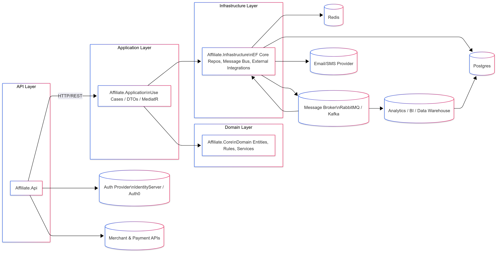
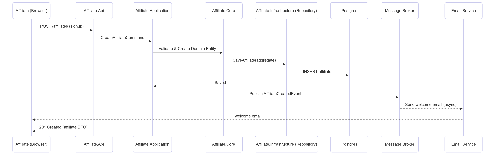
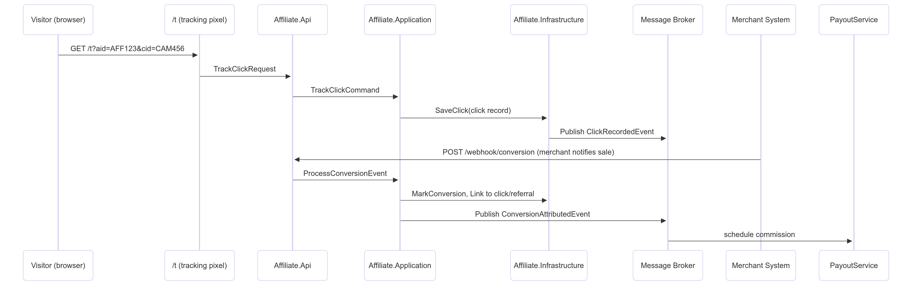
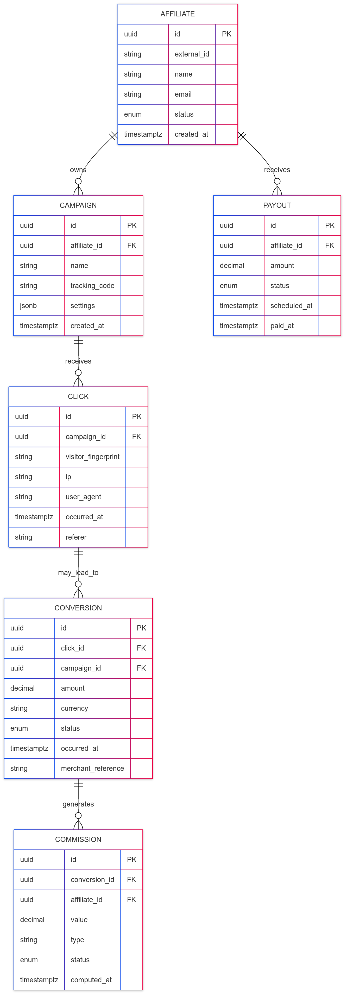

# همکاری در فروش — معماری سطح بالا و دیاگرام‌ها

---

## اهداف / مسئولیت‌ها (کوتاه)
- فعال‌سازی ثبت‌نام همکاران فروش و تأیید ثبت‌نام  
- ردیابی کلیک‌ها/ارجاعات، نسبت دادن تبدیل‌ها (فروش/ثبت‌نام)، محاسبه کمیسیون‌ها و زمان‌بندی پرداخت‌ها  
- ارائه API برای فروشندگان و همکاران (داشبورد) و وب‌هوک‌ها برای رویدادهای فروشندگان  
- پشتیبانی از دسترس‌پذیری بالا، مقیاس‌پذیری در زمان افزایش ترافیک (نقطه پایانی ردیابی)، و حسابداری دقیق برای [...]

---

## دیاگرام اجزای سیستم

# دیاگرام توالی — جریان ثبت‌نام و ارجاع

# توالی — ردیابی و نسبت‌دهی تبدیل

 
# موجودیت‌های دامنه

# سطح API (پایانه‌های پیشنهادی)

**احراز هویت / OAuth2:**  
‎`/oauth/token` (خارجی)

### همکاران فروش

- ‎`POST /api/affiliates` — ثبت‌نام
- ‎`GET /api/affiliates/{id}` — پروفایل
- ‎`POST /api/affiliates/{id}/campaigns` — ایجاد کمپین

### ردیابی

- ‎`GET /t?aid={aid}&cid={cid}&redirect={url}` — ردیابی کلیک و ریدایرکت
- ‎`POST /api/tracking/click` — رویداد سمت سرور (اختیاری)

### یکپارچه‌سازی فروشنده

- ‎`POST /api/webhooks/conversion` — اعلان تبدیل توسط فروشنده

### گزارش‌گیری

- ‎`GET /api/affiliates/{id}/stats?from=&to=&groupBy=`

### پرداخت‌ها

- ‎`GET /api/payouts`
- ‎`POST /api/payouts/{id}/approve` (ادمین)

### مدیریت (Admin)

- ‎`GET /api/admin/commissions/unsettled`
